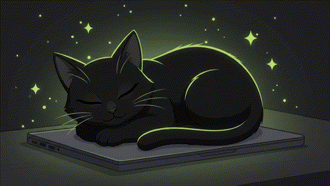
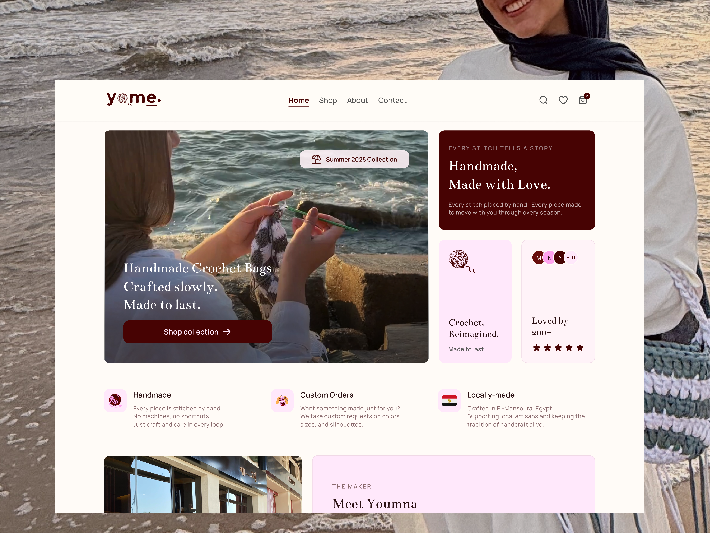

<!-- Cat hero clip — replace src once your Veo 3 render is ready -->

### 🐈‍⬛ About Me

- 🎨 UI/UX Designer with ~1.5 years of experience, currently part-time at **[Orpeaks](https://orpeaks.io)**
- 🎓 4th-year Computer Science student at **FCIS, Mansoura University**
- 🧠 Mentoring entry-level designers through **Technical Gates** at Mansoura University
- 📜 Pursuing the **Google UX Design Certificate** & **Google Agile Project Management** course
- ☕ Fueled by coffee, chaos, and clean interfaces — in that order
- 💻 Also skilled in vibe coding — I don't just design products, I ship them (see **Yume** below, designed *and* built solo)
- 🐾 Black cat energy: quiet until there's a deadline, then everything's on the floor

---

## 🛠️ Tools & Stack  
### 🎨 Design & UX  

    
    
    
    

### 🤖 AI & Creative Tools

  
  
  
  

## 💻 Build & Vibe Coding

### Also working with:
AI Image Generation · AI Video Generation · Arabic / English Content · Figma MCP · Desktop Bridge Scripting

---
### 🏆 Featured Work

<table>
<tr>
<td width="33%" valign="top">

 <b>Yume</b> 
Full e-commerce platform for a handmade crochet wearables brand — designed in Figma, built solo in Next.js 
<a href="https://www.yume-crochetes.store">Live ↗</a>
</td>
<td width="33%" valign="top">

 <b>Tadawena</b> 
A pharmaceutical brand's first digital home — website UI/UX design 
<a href="https://www.tadawena.com">Live ↗</a>
</td>
<td width="33%" valign="top">

 <b>Dukkan (دكان)</b> 
Classifieds marketplace concept for the Saudi market 
<a href="https://www.behance.net/gallery/253454509/Dukkan-Saudi-Marketplace-UIUX-Design-Case-Study">Behance ↗</a>
</td>
</tr>
</table>

More on my [Behance profile ↗](https://www.behance.net/haneenmohamed65)  

---

### 📊 GitHub Activity

  
  

---
### 📫 Let's Collaborate ☕🐈‍⬛

  
  
  
  

